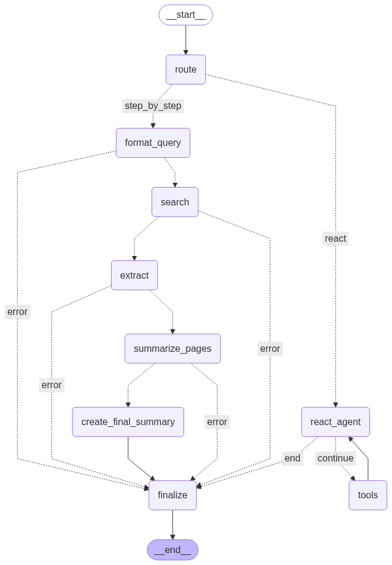

# Search Agent

Агент получает вопрос от пользователя и пытается ответить на него, используя информацию из источников, найденных в интернете.

Источник моделей: Ollama

Поисковый движок: DuckDuckGo

Внедрены 2 подхода, решение о применении которых принимается агентом самостоятельно:
- ReAct agent (pure tool calling); на данный момент поддерживается только для семейства моделей qwen3 (пока так и не понял, почему не работает с другими моделями, поддерживающими tool calling)
- Строгое следование заданным шагам; для всех остальных моделей

## Структура графа



## Интерфейс


## Установка

1. Клонируйте репозиторий:
```bash
git clone https://github.com/terr0d/SearchAgent.git
cd SearchAgent
```
2. Создайте виртуальное окружение и активируйте его:
```bash
python -m venv venv
# Windows
venv\Scripts\activate
# Linux/Mac
source venv/bin/activate
```
3. Установите зависимости:
```bash
pip install -r requirements.txt
```
4. Установите и запустите [Ollama](https://ollama.com/download):
```bash
ollama serve
```
5. Загрузите хотя бы одну модель:
```bash
ollama pull qwen3:8b
```

## Запуск
Веб-интерфейс:
```bash
python gradio_app.py
```

CLI:
```bash
python cli_app.py
```
